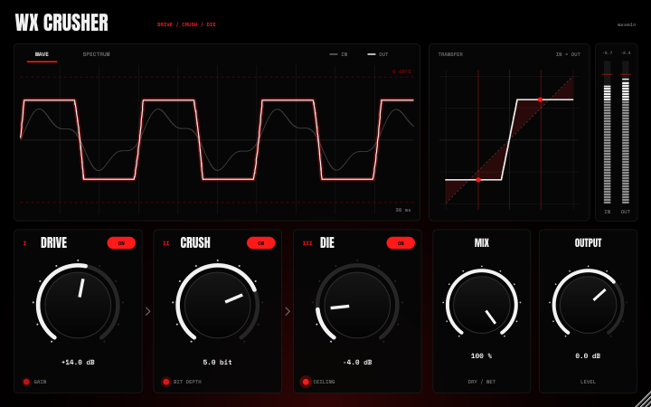

# ★ WX CRUSHER ★

> **"TOTAL SONIC ANNIHILATION."**

**WX CRUSHER** is a high-gain, digital distortion engine engineered for **Rage, Digicore, and Dark Trap** production.
Abandoning analog warmth for digital coldness, it forces any signal into a ruthlessly hard-clipped square wave.

One knob. Zero mercy.

## 🕸️ FEATURES

https://github.com/user-attachments/assets/3e2a1a90-fa60-49c5-8214-3d9cd68a2afa

### **[ ONE KNOB CHAOS ]**
A single control macros 3 stages of DSP processing. No presets, no confusion. Just turn it up to destroy.

### **[ VISUAL FEEDBACK ]**
Reactive LED system indicating the level of signal degradation:
* **⚪ DRIVE:** Signal Boost (+2000%)
* **⚪ CRUSH:** Bit-Depth Reduction (16-bit → 3-bit)
* **🔴 DIE:** Hard Clipping Limit reached (Total Distortion)

### **[ AESTHETIC ]**
* **PITCH BLACK** Background
* **STARK WHITE** Controls
* **BLOOD RED** Visuals on max capacity

## 🏴‍☠️ DSP ARCHITECTURE

The signal path is designed to mimic **digital data corruption**:

| STAGE | PROCESS | EFFECT |
| :--- | :--- | :--- |
| **I** | **EXTREME GAIN** | Input signal amplified by **20x (+26dB)**. |
| **II** | **DECIMATION** | Linearly reduces bit-depth down to **3-bits**. Introduces heavy quantization noise. |
| **III** | **HARD CLIP** | Signal is aggressively clamped at **0dB**. Forces sine waves into square waves. |

## 🦇 INSTALLATION

### USERS
1.  Grab the latest **`.vst3`** from [**Releases**](../../releases).
2.  Drop it into your VST3 directory:
    * `C:\Program Files\Common Files\VST3`
3.  Rescan DAW.

### DEVELOPERS
* **IDE:** Visual Studio 2026 / Xcode
* **Framework:** JUCE 7+
* **Standard:** C++17

---

### **★ ENGINEERED BY WXXMIN ★**
*No copyright intended. Just pure noise.*
